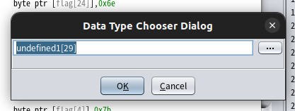
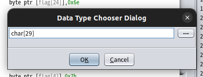

# command_line（written by 滝上）
## 解法
Ghidraを開くとflagが格納されている配列が見つかる。asciiに変換して並び替えるとフラグを入手できる。

`FLAG{c0mm4nd_l1n3_4rgum3nts}`

## 詳細
`command_line.gzf`を開くと、以下のように表示がされます。

```c
int main(int argc,char **argv)

{
  int iVar1;
  
  flag[5] = 99;
  flag[0] = 0x46;
  flag[0x18] = 0x6e;
  flag[2] = 0x41;
  flag[0x1b] = 0x7d;
  flag[0x17] = 0x33;
  flag[4] = 0x7b;
  flag[0xe] = 0x31;
  flag[0xc] = 0x5f;
  flag[7] = 0x6d;
  flag[0x1a] = 0x73;
  flag[1] = 0x4c;
  flag[0x12] = 0x34;
  flag[9] = 0x34;
  flag[0x14] = 0x67;
  flag[6] = 0x30;
  flag[0xf] = 0x6e;
  flag[0xd] = 0x6c;
  flag[0xb] = 100;
  flag[8] = 0x6d;
  flag[0x11] = 0x5f;
  flag[0x19] = 0x74;
  flag[10] = 0x6e;
  flag[3] = 0x47;
  flag[0x16] = 0x6d;
  flag[0x13] = 0x72;
  flag[0x15] = 0x75;
  flag[0x10] = 0x33;
  if (1 < argc) {
    iVar1 = strcmp(flag,argv[1]);
    if (iVar1 == 0) {
      puts("Correct!");
      puts(flag);
    }
    else {
      puts("Wrong...");
    }
  }
  return 0;
}
```

flagという怪しい名前の配列になにか値が代入されていますね。しかし、このままだと16進数(0xから始まる値)が代入されていて、読めません。僕らでも読めるように文字に変換したいものです。

そこでデータ型の変換をしましょう。例えば`flag[5]`という文字列を選択して、右クリックして`Retype Global`を選択または`CTRL+L`を押しましょう。以下のような画面が表示されるはずです。



undefined1[29]となっているのでchar[29]に変えてokを押しましょう。char型というのはC言語等でよく使われる文字を扱うための型です。



そうするとflagは以下のように変換されます。

```c
int main(int argc,char **argv)

{
  int iVar1;
  
  flag[5] = 'c';
  flag[0] = 'F';
  flag[0x18] = 'n';
  flag[2] = 'A';
  flag[0x1b] = '}';
  flag[0x17] = '3';
  flag[4] = '{';
  flag[0xe] = '1';
  flag[0xc] = '_';
  flag[7] = 'm';
  flag[0x1a] = 's';
  flag[1] = 'L';
  flag[0x12] = '4';
  flag[9] = '4';
  flag[0x14] = 'g';
  flag[6] = '0';
  flag[0xf] = 'n';
  flag[0xd] = 'l';
  flag[0xb] = 'd';
  flag[8] = 'm';
  flag[0x11] = '_';
  flag[0x19] = 't';
  flag[10] = 'n';
  flag[3] = 'G';
  flag[0x16] = 'm';
  flag[0x13] = 'r';
  flag[0x15] = 'u';
  flag[0x10] = '3';
  if (1 < argc) {
    iVar1 = strcmp(flag,argv[1]);
    if (iVar1 == 0) {
      puts("Correct!");
      puts(flag);
    }
    else {
      puts("Wrong...");
    }
  }
  return 0;
}
```

無事に文字に変換されましたね。このまま上から読んでもよくわかりませんが F, L, A, G, {, }あたりの文字が含まれているので、並び替えてやればFLAGを入手できそうです。以下のコードで並び替えました。

```c
#include <stdio.h>

int main() {
    char flag[30];
    flag[5] = 'c';
    flag[0] = 'F';
    flag[0x18] = 'n';
    flag[2] = 'A';
    flag[0x1b] = '}';
    flag[0x17] = '3';
    flag[4] = '{';
    flag[0xe] = '1';
    flag[0xc] = '_';
    flag[7] = 'm';
    flag[0x1a] = 's';
    flag[1] = 'L';
    flag[0x12] = '4';
    flag[9] = '4';
    flag[0x14] = 'g';
    flag[6] = '0';
    flag[0xf] = 'n';
    flag[0xd] = 'l';
    flag[0xb] = 'd';
    flag[8] = 'm';
    flag[0x11] = '_';
    flag[0x19] = 't';
    flag[10] = 'n';
    flag[3] = 'G';
    flag[0x16] = 'm';
    flag[0x13] = 'r';
    flag[0x15] = 'u';
    flag[0x10] = '3';

    printf("%s\n", flag);

    return 0;
}
```

実行結果は以下のようになります。

```sh
FLAG{c0mm4nd_l1n3_4rgum3nts}
```