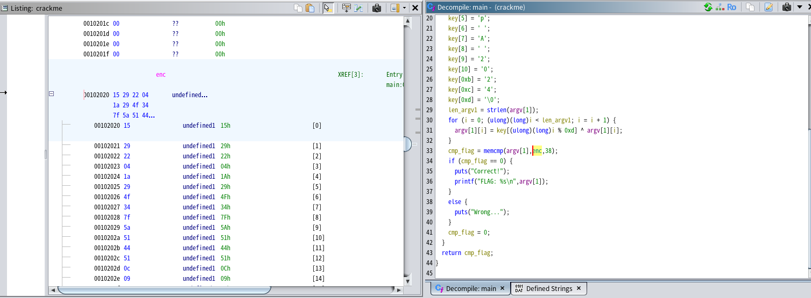
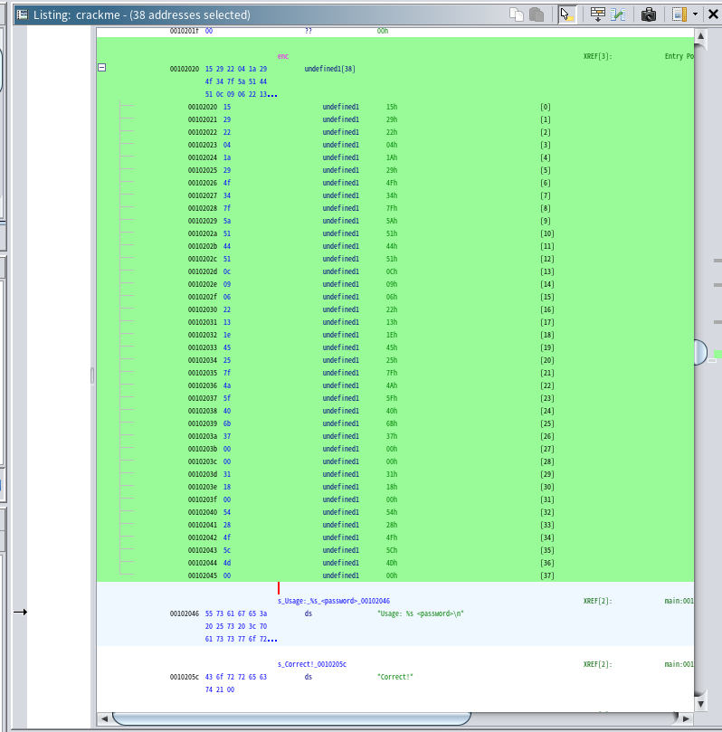
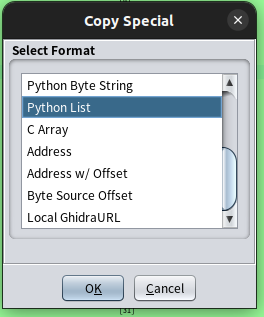

# crackme(by 滝上)
## 解法
入力文字列を`SecCap A 2024\0`という鍵でxor暗号化し、その結果を予め用意されているencと比較して正しければFLAGが表示される。encが入力すべき文字列のxor暗号化であることが推測されるため、これを取得して実行ファイルに入力すると再度xor暗号化がされフラグを得る

`FLAG{You_have_learned_xor_decryption}`

## 詳細
まず実行ファイル(crackme)を実行してみましょう。以下のように表示されます。
```sh
$ ./crackme
Usage: ./crackme <password>
```
passwordを入力として渡してやる必要があるようです。渡してやりましょう。
```sh
$ ./crackme aaa
Wrong...
```
間違っているらしいです。おそらくpasswordに正しい入力を与えることができればFLAGを得られるのでしょう。しかしこれ以上の情報はありませんし、他に配られているファイルは`crackme.gzf`しかありません。仕方ないので解析していきましょう。

Ghidraを起動して`crackme.gzf`を開くと以下のmainを見つけることが出来ます。

```c
int main(int argc,char **argv)

{
  int iVar1;
  size_t sVar2;
  byte local_128 [258];
  char local_26 [14];
  int local_c;
  
  if (argc < 2) {
    printf("Usage: %s <password>\n",*argv);
    iVar1 = 1;
  }
  else {
    local_26[0] = 'S';
    local_26[1] = 'e';
    local_26[2] = 'c';
    local_26[3] = 'C';
    local_26[4] = 'a';
    local_26[5] = 'p';
    local_26[6] = ' ';
    local_26[7] = 'A';
    local_26[8] = ' ';
    local_26[9] = '2';
    local_26[10] = '0';
    local_26[0xb] = '2';
    local_26[0xc] = '4';
    local_26[0xd] = '\0';
    strcpy((char *)local_128,argv[1]);
    sVar2 = strlen((char *)local_128);
    for (local_c = 0; (ulong)(long)local_c < sVar2; local_c = local_c + 1) {
      local_128[local_c] = local_128[local_c] ^ local_26[(ulong)(long)local_c % 0xd];
    }
    iVar1 = memcmp(local_128,enc,0x26);
    if (iVar1 == 0) {
      puts("Correct!");
      printf("FLAG: %s\n",argv[1]);
    }
    else {
      puts("Wrong...");
    }
    iVar1 = 0;
  }
  return iVar1;
}
```

Correct!と書かれている部分があります。その下に`FLAG: `があり、この処理に進めるとFLAGが表示される気配があります。見やすいように`local_c`などの変数名を変えて以下のようにしました。

```c

int main(int argc,char **argv)

{
  int cmp_flag;
  size_t len_argv1;
  char key [14];
  int i;
  
  if (argc < 2) {
    printf("Usage: %s <password>\n",*argv);
    cmp_flag = 1;
  }
  else {
    key[0] = 'S';
    key[1] = 'e';
    key[2] = 'c';
    key[3] = 'C';
    key[4] = 'a';
    key[5] = 'p';
    key[6] = ' ';
    key[7] = 'A';
    key[8] = ' ';
    key[9] = '2';
    key[10] = '0';
    key[0xb] = '2';
    key[0xc] = '4';
    key[0xd] = '\0';
    len_argv1 = strlen(argv[1]);
    for (i = 0; (ulong)(long)i < len_argv1; i = i + 1) {
      argv[1][i] = key[(ulong)(long)i % 0xd] ^ argv[1][i];
    }
    cmp_flag = memcmp(argv[1],enc,38);
    if (cmp_flag == 0) {
      puts("Correct!");
      printf("FLAG: %s\n",argv[1]);
    }
    else {
      puts("Wrong...");
    }
    cmp_flag = 0;
  }
  return cmp_flag;
}
```

まずフラグが表示される条件を見てみましょう。このあたりになります。

```c
    cmp_flag = memcmp(argv[1],enc,38);
    if (cmp_flag == 0) {
      puts("Correct!");
      printf("FLAG: %s\n",argv[1]);
    }
```

cmp_flagが0であればフラグが表示されます。cmp_flagはmemcmpの結果が渡されていて、どうやらargv[1] (ユーザからの入力)とencを比較しているようです。memcmpは２つの変数を比較して同じ値であると判定された場合、返り値として0を返す仕組みになっています。つまり、ユーザからの入力がencと同一であればFLAGが表示されるようです。

ではencをGhidraで探してやって入力すればいいのかというと、そうも行きません。もう少し上の処理を見るとこのような記述があります。

```c
    len_argv1 = strlen(argv[1]);
    for (i = 0; (ulong)(long)i < len_argv1; i = i + 1) {
      argv[1][i] = key[(ulong)(long)i % 0xd] ^ argv[1][i];
    }
```

argv[1]の値が謎の処理が加えられて再代入されています。つまり、この処理を加えられたあとにencと同一の値となるように値を入力してやる必要がありそうです。

しかしどんな処理かよくわからないのでとりあえずChatGPTに聞いてみます。

質問
```
以下の処理はどんな処理ですか。日本語で解説してください。

    len_argv1 = strlen(argv[1]);
    for (i = 0; (ulong)(long)i < len_argv1; i = i + 1) {
      argv[1][i] = key[(ulong)(long)i % 0xd] ^ argv[1][i];
    }
```
回答
```
この処理は、argv[1] に含まれる文字列をある鍵（key）を使って1文字ずつ XOR 演算で暗号化または復号化する処理です。

argv[1] の長さ（len_argv1）を取得し、その長さだけループを実行。
各文字に対して、key の対応する位置の文字（key[i % 13]）と XOR 演算を行い、元の文字列を変換しています。
これは、簡単な XOR ベースの暗号化手法です。
```

どうやらxor暗号化というものが行われているらしいです。つまり、入力値をxor暗号化したものがencになれば良い、ということになりそうです。

ではencを復号するにはどうしたら良いのでしょうか。これもChatGPTに聞いてみましょう。

質問
```
xor暗号を復号する方法を教えてください
```

回答
```
XOR暗号を復号するには、暗号化に使用したのと同じ鍵を使ってもう一度XOR演算を行えば復号できます。これは、XORの性質に基づいています。

具体的には、暗号化された文字に対して同じ鍵の対応する文字で再びXOR演算を行うことで、元の文字列を取り戻すことができます。XORの演算は以下のような性質を持っているからです：

(平文) ⊕ (鍵) ⊕ (鍵) = 平文

これにより、簡単に復号が可能です。
```

encをもう一度同じ鍵でxor暗号化してやれば平文を取り出すことができそうです。つまり、実行時に入力としてencを渡してやればencの平文を取り出せます。

ということでencを探しに行きましょう。Ghidra上でencをダブルクリックすると、encが確保されているメモリ領域をListng windowに表示してくれます。



ここからencの値をコピーしましょう。copy specialでpythonの配列としてゲットします

enc全体を選択して



copy specialでpython listを選択してコピーします



入手した値を実行ファイルに入力して復号！と行きたいところですが、できません。入手した配列の値を見てみましょう

```py
enc = [
    0x15, 0x29, 0x22, 0x04, 0x1a, 0x29, 0x4f, 0x34, 0x7f, 0x5a, 
    0x51, 0x44, 0x51, 0x0c, 0x09, 0x06, 0x22, 0x13, 0x1e, 0x45, 
    0x25, 0x7f, 0x4a, 0x5f, 0x40, 0x6b, 0x37, 0x00, 0x00, 0x31, 
    0x18, 0x00, 0x54, 0x28, 0x4f, 0x5c, 0x4d, 0x00
]
```

0x15や0x0fという値がありますね。このあたりは文字に変換すると改ページ等の制御文字となっており通常の文字ではないため、シェルから入力することが出来ません。

仕方がないので実行ファイル中の暗号化処理を拾ってきて復号することにしましょう。復号(暗号化)に関連する処理は以下になります。

```c
    key[0] = 'S';
    key[1] = 'e';
    key[2] = 'c';
    key[3] = 'C';
    key[4] = 'a';
    key[5] = 'p';
    key[6] = ' ';
    key[7] = 'A';
    key[8] = ' ';
    key[9] = '2';
    key[10] = '0';
    key[0xb] = '2';
    key[0xc] = '4';
    key[0xd] = '\0';
    len_argv1 = strlen(argv[1]);
    for (i = 0; (ulong)(long)i < len_argv1; i = i + 1) {
      argv[1][i] = key[(ulong)(long)i % 0xd] ^ argv[1][i];
    }
```
これをpythonコードで書き出すと以下のようになります。argv[1]の部分をencに変えています。
```py
key = "SecCap A 2024"
enc = [
    0x15, 0x29, 0x22, 0x04, 0x1a, 0x29, 0x4f, 0x34, 0x7f, 0x5a, 
    0x51, 0x44, 0x51, 0x0c, 0x09, 0x06, 0x22, 0x13, 0x1e, 0x45, 
    0x25, 0x7f, 0x4a, 0x5f, 0x40, 0x6b, 0x37, 0x00, 0x00, 0x31, 
    0x18, 0x00, 0x54, 0x28, 0x4f, 0x5c, 0x4d, 0x00
]

dec = ''.join(chr(enc[i] ^ ord(key[i % len(key)])) for i in range(len(enc) - 1))
print(dec)

```
これを実行すると以下を得ます。
```
FLAG{You_have_learned_xor_decryption}
```
FLAGが得られましたね...どうやらFLAGを守るためのpasswordがFLAGであったという斬新なシステムだったようです。こういう問題形式を俗にcrackmeと言って、解析対象の実行ファイル自体からreversingにより答えを探し出します。

ちなみにpasswordがFLAGであることは以下のコード
```c
printf("FLAG: %s\n",argv[1]);
```
より確かめられて、入力値がFLAGとして出力されています。