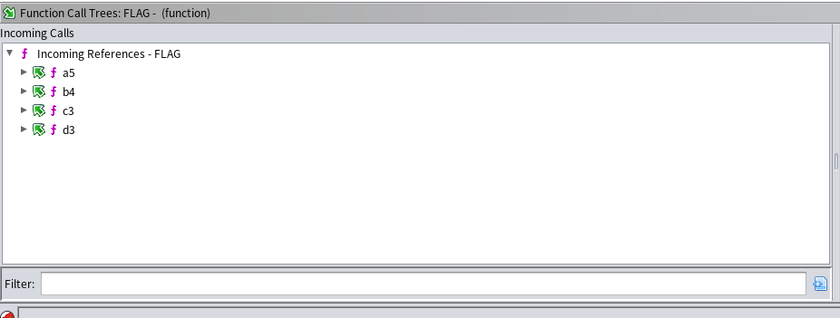
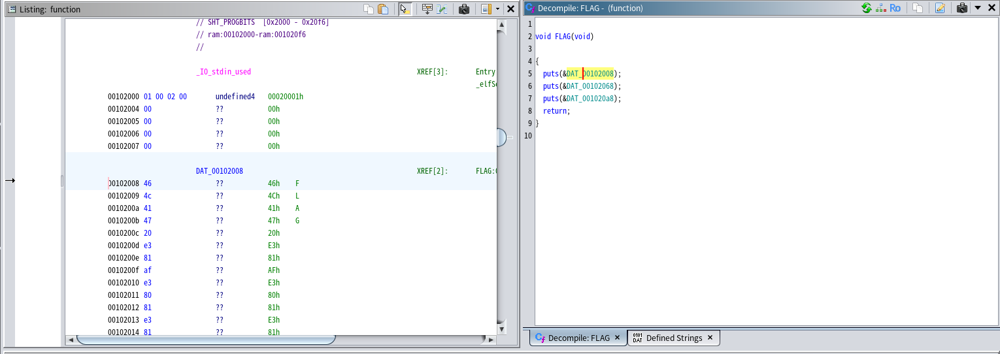
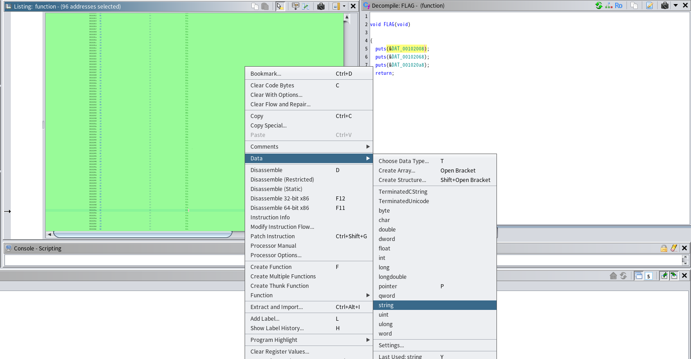
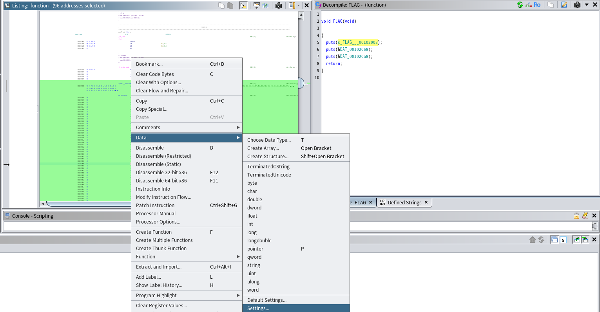
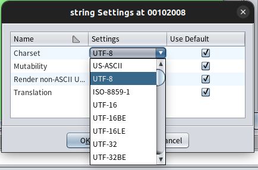
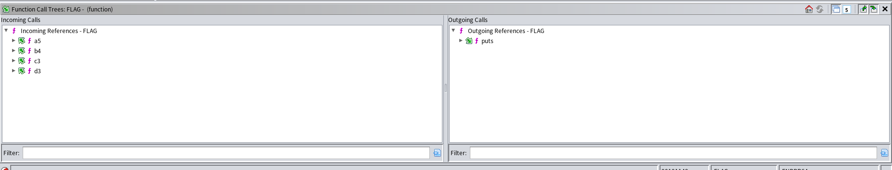

# function(written by 滝上)

## 解法
function call treeを確認する



`FLAG{a5_b4_c3_d3}`

## 詳細
まず実行してみましょう。以下の出力が確認できます

```
FLAG は、この関数を呼び出している関数名を_で連結したものです。
連結する順番は、アルファベット順です。
例：この関数がa1とb1から呼び出されている場合、FLAG{a1_b1}
FLAG は、この関数を呼び出している関数名を_で連結したものです。
連結する順番は、アルファベット順です。
例：この関数がa1とb1から呼び出されている場合、FLAG{a1_b1}
FLAG は、この関数を呼び出している関数名を_で連結したものです。
連結する順番は、アルファベット順です。
例：この関数がa1とb1から呼び出されている場合、FLAG{a1_b1}
FLAG は、この関数を呼び出している関数名を_で連結したものです。
連結する順番は、アルファベット順です。
例：この関数がa1とb1から呼び出されている場合、FLAG{a1_b1}
```

やたら同じ文章が呼び出されていることは置いといて、FLAGの書き方が書かれています。どうやらこのFLAGの書き方を指南してくれている文字列を呼び出している関数を呼び出し順に並べることが必要なようです。だから何回も表示されてるんですね、すごく親切なプログラムなのかと思いました。

という訳でこの文字列が表示される関数が何なのかを探し当てる必要がありますね。`function.gzf`をGhidraで解析していきましょう。以下のようなmain関数が表示されます。

```c
undefined8 main(void)

{
  A();
  B();
  C();
  D();
  return 0;
}
```

シンプルに4つの関数が呼び出されてますね。一旦1番上のAを追ってみましょう。

Aを呼び出すと中でa1が呼ばれていて、a1の中でa2が呼ばれていて...と見ていくと最終的にa5の中で`FLAG()`という怪しい関数が呼ばれています。ほぼ確実にこの関数を呼び出す関数を連結すればいいと思うのですが、一応確認しましょう。`FLAG()`の中身はこうなっています。

```c
void FLAG(void)

{
  puts(&DAT_00102008);
  puts(&DAT_00102068);
  puts(&DAT_001020a8);
  return;
}
```
`puts()`が3回呼ばれていますね。これらが冒頭で紹介したFLAGの書き方を説明している文章であれば確定できそうです。DATが呼ばれているので中味を確認しに行きましょう。例えばDAT_00102008をダブルクリックするとListingウィンドウに以下のようにDATの値が表示されます。



断片的にFLAGという値が見えていますが、それ以外が何が書かれているのかわかりません。おそらく日本語への変換がデフォルト設定だと出来ないんでしょうね。仕方ないのでデータ型を変えます。

DAT_00102008全体を選択して、データ型を一旦stringに変換します。


そしてData->Settingsを選択し、


string settingsのcharsetをutf-8に変換します。


するとソースコード上に以下のように表示されるようになりました。
```c
void FLAG(void)

{
  puts("FLAG は、この関数を呼び出している関数名を_で連結したものです。")
  ;
  puts(&DAT_00102068);
  puts(&DAT_001020a8);
  return;
}
```

他の2行もやると以下のようになります。

```c

void FLAG(void)

{
  puts("FLAG は、この関数を呼び出している関数名を_で連結したものです。")
  ;
  puts("連結する順番は、アルファベット順です。");
  puts("例：この関数がa1とb1から呼び出されている場合、FLAG{a1_b1}");
  return;
}
```

確定ですね。`FLAG()`を呼び出している関数を順に追えば良いことがわかりました。ここで、main関数を思い出してみましょう。この部分です。

```c
  A();
  B();
  C();
  D();
```

A->B->C->Dの順に関数が呼び出されているので、`FLAG()`を呼び出す関数もABCDの順に並べれば良さそうです。ただそれぞれの関数の処理を追っていくのはめんどくさいですね...という訳でFunction Call Treesを見ます。これを見れば、どの関数が`FLAG()`を呼び出しているのかがすぐにわかります。早速`FLAG()`のFunction Call Treesを見てみましょう



Incoming Callsの方は`FLAG()`を呼び出している関数、Outcoming Calssの方は`FLAG()`が呼び出している関数を表しています。よってIncoming Callsで呼び出されている関数をABCDの順番に並べるとFLAGになります。