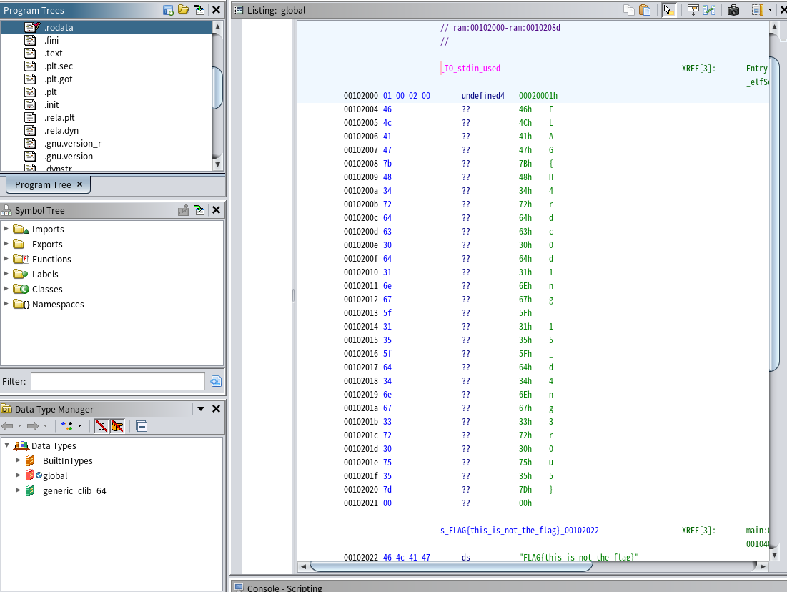
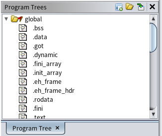

# global(written by 滝上)

## 解法
メモリの.rodataに当たる部分を見に行けばFLAGを得ることができる



## 詳細
まずは配られた実行ファイルを実行してみましょう

```sh
$ ./global 
Usage: ./global <password>
```

passwordが必要なようです。とりあえず入力を与えて実行しましょう

```sh
$ ./global pass
Incorrect!
```

Incorrect!と表示されました。passwordが合っていればCorrect!になるんでしょうか。なってほしいですね。

確かめるためにGhidraで解析してみましょう。Ghidraを開き、`global.gzf`を解析します。main関数は以下のようになっていました。

```c
int main(int argc,char **argv)

{
  int iVar1;
  
  if (argc == 2) {
    iVar1 = strcmp(argv[1],dummy);
    if (iVar1 == 0) {
      puts("No! This is not flag");
      puts("The true flag is somewhere");
    }
    else {
      puts("Incorrect!");
    }
    iVar1 = 0;
  }
  else {
    printf("Usage: %s <password>\n",*argv);
    iVar1 = 1;
  }
  return iVar1;
}
```

Correct!って表示されないじゃん...

気を取り直して解析を続けましょう。まずifの分岐があります。

```c
  if (argc == 2) {
```

argcはargv配列の要素数を表します。argvは1つ目の要素に実行するファイルのファイル名が入り、2つ目以降の要素には実行時に入力から与えられる引数が代入されます。つまり、以下ならargv[0]="./global", argv[1]="password", argc=2になります。

```c
./global password
```

以下ならargv[0]="./global", argv[1]="password", argv[2]="more?password", argc=3です。

```c
./global password more_password
```

今回はargcが2であれば処理が続き、それ以外であればprintfで使い方が表示されて終了するようになっています。要は単に使い方の説明をしてくれているだけですね。

次にpasswordを入力として与えたときの操作を追っていきましょう。以下のコードがあります
```c
iVar1 = strcmp(argv[1],dummy);
```

strcmpは1つ目の引数と2つ目の引数を比較して、等しければ0を返す関数です。つまり`dammy`と値が一致すれば次の処理に進めます。

`dummy`と一致という時点でなんだかFLAGではなさそうですが、実際続きの処理は以下のようになっています。

```c
    if (iVar1 == 0) {
      puts("No! This is not flag");
      puts("The true flag is somewhere");
    }
```

`iVar1`はstrcmpの返り値です。つまり頑張って`dummy`と一致させても返されるのは"これはFLAGじゃないよ！"というそっけない返事だということがわかります。世知辛いですね。

ここまででmain関数の解析は終わってしまいました。困りました、どこにもFLAGないですね。...しかし、main関数から呼び出される部分ではない所、つまり実行時に実行されない関数や、使用されない変数にFLAGが置いてある可能性はあります。

という訳で片っ端から見ていきましょう。詳細は割愛しますが、Symbol TreeにあるFunctionsを全て見てもFLAGらしきものは見当たりません。次に変数を確認します。これはGhidra左上のProgram Treesを順番に見ていけばよいです(下図の部分)。



順番に見ていくと.rodataの項目で以下のようにFLAGが定義されているのを確認できます。


というわけでFLAGを取得することが出来ました。なぜこれがどの関数を調べても出てこない変数なのかというと、グローバル変数と呼ばれる定義の仕方をされている変数だからであり、どの関数のローカル変数でもないため、関数の解析だけを頑張っていても確認できないようになっていました。

ちなみに別解にはなりますが、結局FLAGの値は実行ファイル中にハードコーディング(ソースコードに直接値が書かれている)されているためstringsコマンドを使ってもFLAGを得ることが出来ます。

```sh
$ strings global | grep FLAG
FLAG{H4rdc0d1ng_15_d4ng3r0u5}
FLAG{this_is_not_the_flag}
```