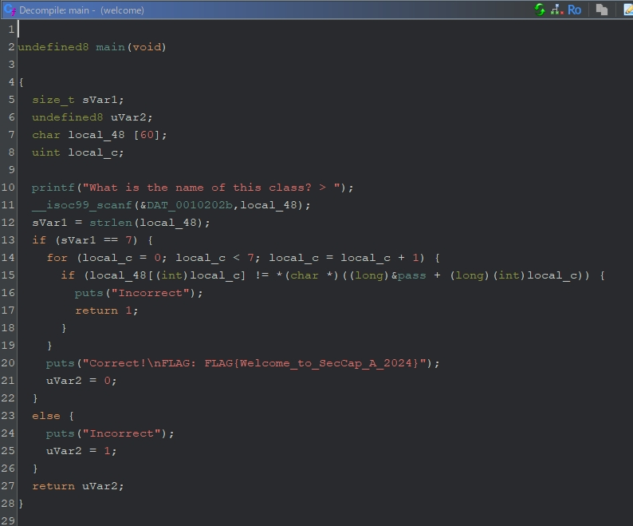

# welcome（written by 山田）
## 解法
Ghidra で`welcome.gzf`を開くと、puts関数の引数にFLAGらしきものが見つかる。

**FLAG{Welcome_to_SecCap_A_2024}**

## 詳細
このプログラムを実行すると、`What is the name of this class? > `と尋ねられ、正しい答えである`SecCapA`と入力すると、`FLAG{Welcome_to_SecCap_A_2024}`が出力される。

入力が正しいかどうかの検査は、14行目〜18行目で行っている。以下は変数名を修正したGhidraの画面であるが、入力文字列と`pass`に格納されている文字を比較していることがわかる。

`pass`を見てみると、`53 65 63 43 61 70 41`というバイト列が見つかる。これをASCII文字として解釈すると、`SecCapA`になる。

ちなみに、`pass`のバイト列を範囲選択し、右クリックの[Data] -> [string] を選択すると、Ghidraにさきほどのバイト列を文字列として解釈させることができる。Ghidraでは、正しい型を教えてあげるとスッキリする場面がよくある。

