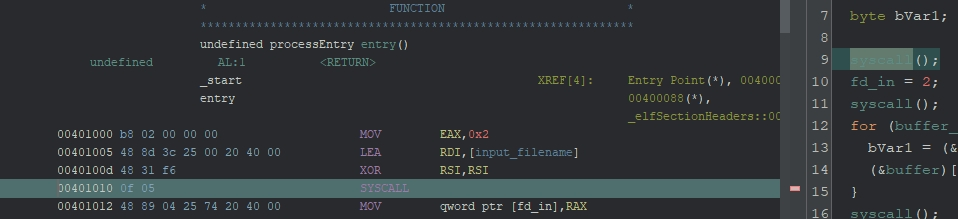

# assembly（written by 山田）
マルウェアが用いるシェルコードというテクニックを知ってほしく、この問題を作問しました。本来のシェルコードは、名前のとおりシェルの起動を目的とした攻撃コードであり、アセンブラ言語で直接書かれることがあります。この問題は、悪意のあるコードではありませんが、アセンブラ言語から直接コンパイルすることによって作成しています。システムコールのアセンブラをコンパイルしたバイナリは、リバースエンジニアリングがしにくくなります。

## 解法
アセンブラレベルでのシステムコールを用いた、ファイル読み書き、暗号化を理解し、それの逆処理（復号）を行うことでフラグを求める。

## 詳細
`encrypter.gzf` をGhidraで読み込ませると、問題文にもあるとおりデコンパイル結果がおかしいことがわかる。例えば、`syscall`関数が何度も呼び出されているが、具体的にどのシステムコールが呼び出されているのか分からない。


これはGhidraがデコンパイルに失敗していると推測することができる。そういう時は、Listing Window のアセンブリを見てやる必要がある。

試しに、9行目の`syscall`を範囲選択すると、それに対応するアセンブラがListing Window 上でハイライトされる。このSYSCALL命令は、プログラムがOSのカーネルに対して直接リクエストを送るための命令である。どの種類のリクエストを送るかは、`SYSCALL`が呼び出されたときのレジスタ`RAX`の値によって判断される（[参考](https://en.wikibooks.org/wiki/X86_Assembly/Interfacing_with_Linux)）のだが、Ghidraはレジスタの値からシステムコール番号（どのリクエストか）を対応付けることができず、デコンパイルに失敗しているようである。



さて、カーネルにどのようなリクエストが送られているのかを具体的に調べてみる。先の`SYSCALL`が呼び出される前のアセンブラを読むと、次のようなことが分かる。（[参考](https://www.mztn.org/lxasm64/x86_x64_table.html#:~:text=5-,open,-2)）
- EAX = 0x2（open）
- RDI = input_filenameのアドレス（第一引数）
- RSI = 0（第二引数）

```
MOV EAX, 0x2
LEA RDI, [input_filename]
XOR RSI, RSI
SYSCALL
```

よって、input_filename(=flag.txt)のファイルをオープンしていることが分かる。問題文の情報ともすり合わせると、`flag.txt`のファイルを開き、その内容を暗号化した結果を`encrypted_flag.txt`に保存していると推測することができる。

詳細は割愛するが、同様にアセンブラからシステムコールを追っていくと、`flag.txt`の内容が`buffer`に入ることがわかる。そして、`buffer`に対して、以下の部分で暗号化を行っている。

```asm
                             encrypt_loop                                    XREF[1]:     0040105e(j)  
        00401042 8a 87 1c 20 40 00                 MOV        AL,byte ptr [RDI + buffer]
        00401048 84 c0                             TEST       AL,AL
        0040104a 74 14                             JZ         done
        0040104c 02 04 25 5c 20 40 00              ADD        AL,byte ptr [shift_value]                        = 03h
        00401053 d0 c8                             ROR        AL,0x1
        00401055 88 87 1c 20 40 00                 MOV        byte ptr [RDI + buffer],AL
        0040105b 48 ff c7                          INC        RDI
        0040105e eb e2                             JMP        encrypt_loop
```

暗号化方法は、各バイトに対して以下のことを行っている。
- ADD AL, byte ptr [shift_value] ( = 3)
- ROR AL, 0x1

つまり、`flag.txt` の内容を復号するには、`encrypted_flag.txt`の各バイトに対して、以下の処理を行えばいい。
1. ROL1 (1左ローテートシフト)
2. 3を減算

以上の復号を行うスクリプトをpythonで書くと、フラグが求まる。

```python
def rol(n):
    return ((n << 1) & 0xFF) | (n >> 7)

with open("encrypted_flag.txt", "rb") as f:
    read_data = bytearray(f.read())

print("".join(chr(rol(b) - 3) for b in read_data))
```

**FLAG{Don't_trust_decompilers_too_much}**