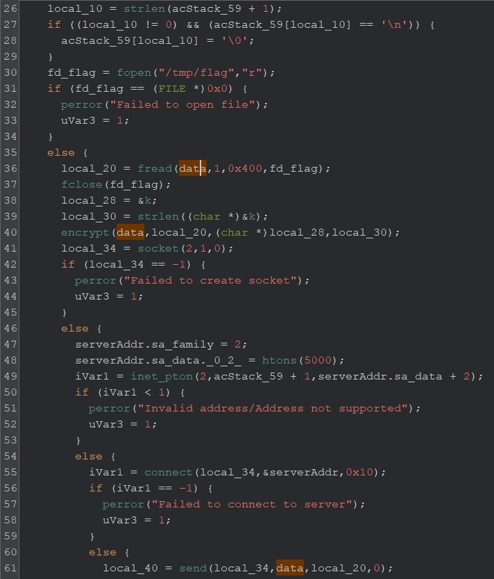
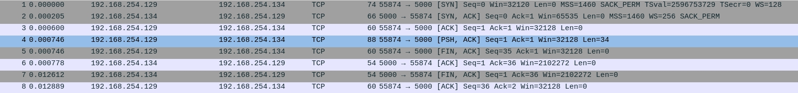
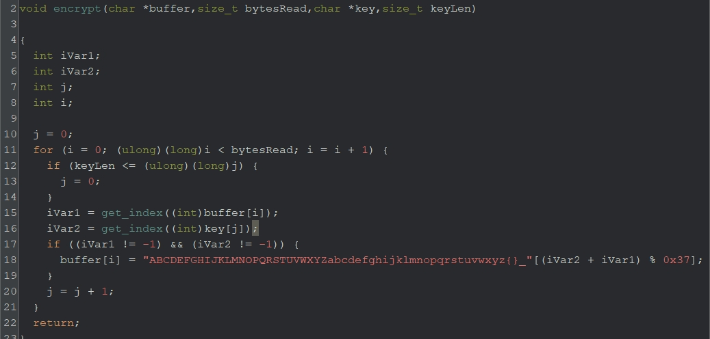

# incident（by 山田）
pcapとreversingの融合問題を作りました。マルウェアは、ソケット通信を使って外部のリモート＆コントロール(C2)サーバと接続し、機密情報を送信することがあります。この問題でも、ソケット通信を用いて暗号化したデータを外部に送信しています。

## 解法
`/tmp/flag`の内容が暗号化され、その暗号データがソケット通信を用いて外部に送信されていることを理解する。pcapファイルから暗号データを取り出し、復号することでFLAGを求める。

## 詳細
`incident.gzf`をGhidraで開き、main関数を解析する。36行目の`fread`の第一引数で使われている変数(`data`)の流れを追うと、以下のことがわかる。
1. `fopen`と`fread`により`/tmp/flag`の内容を読み込む
2. 読み込んだ内容が、`encrypt`関数の第一引数に渡されている
3. `send`関数で外部に送信している



このことから、`flag`の内容に対して何かしらの暗号化を行い、ソケット通信を用いて外部に送信しているだろうと推測ができる。そのため、暗号化方式と暗号データが分かれば、`flag`を復号できそうである。

### pcapファイル
まずは、暗号データを取得するため、`incident.pcap`をWiresharkで解析する。パケット数は8と少ないため、眺めると以下の流れが分かる。

1. TCP 3ウェイハンドシェイクが成功し、接続が確立
2. データが192.168.254.129から192.168.254.134に送信される
3. データ送信後、TCP接続が終了



送信されたデータを取得するため、TCPストリーム(Ctrl + alt +  shift + T)を開く。すると、`{tgkkWWHWSHSOdWTuJDTidhPuIHDbZdUt
`という34バイトのデータが送信されており、これが暗号データだと推測することができる。

### 暗号化方式の特定
暗号データが求まったので、後は暗号化方式を特定するだけである。Ghidraに戻り、`encrypt`関数を解析すると以下の処理がわかる。
- flagのデータ(`buffer`)を１文字ずつエンコードしている
  - テーブル`ABCDEFGHIJKLMNOPQRSTUVWXYZabcdefghijklmnopqrstuvwxyz{}_`を使用し、エンコード
  - *エンコードする文字*のテーブルにおけるインデックスを求める
  - *鍵の文字*のテーブルにおけるインデックスを求める
  - それぞれを加算した値をインデックスとするテーブルの文字に変換



エンコード方式を表にすると、以下のようになる。例えば、`F`を鍵`v`を用いてエンコードすると、`{`となる。ちなみに、このエンコード方法は[ヴィジュネル暗号](https://ja.wikipedia.org/wiki/%E3%83%B4%E3%82%A3%E3%82%B8%E3%83%A5%E3%83%8D%E3%83%AB%E6%9A%97%E5%8F%B7)を少し改良したものである。


後は、鍵が分かれば`flag`を復号できる。

### 鍵の取得
鍵(key)は`encrypt`関数に第三引数として渡されているので、main関数に戻って解析すると`k`というグローバル変数が鍵であることが分かる。鍵の値は、`76 69 67 65 6e 65 72 65`であり、ASCII文字にすると`vigenere`である。

後は、復号するスクリプトを書けばよい。

### 復号
pythonで復号スクリプトを書く。暗号文を１文字ずつ、鍵を用いて復号すればよい。具体的には、暗号された文字のテーブル内のインデックスを求め、それから鍵のインデックスを減算する。計算結果の`mod TABLESIZE`を取らなければいけないことに注意する。

```python
enc = "{tgkkWWHWSHSOdWTuJDTidhPuIHDbZdUt"
key = "vigenere"
table = "ABCDEFGHIJKLMNOPQRSTUVWXYZabcdefghijklmnopqrstuvwxyz{}_"

TABLE_SIZE = len(table)

def decrypt(enc, key):
    enc = list(enc)
    enc_len = len(enc)
    key_len = len(key)
    dec = [0] * enc_len
    
    for i, e in enumerate(enc):
        shift = table.find(e)
        index_flag = (shift - table.find(key[i % key_len])) % TABLE_SIZE
        dec[i] = table[index_flag]

    return ''.join(dec)

print(decrypt(enc, key))
```

**FLAG{vigenere_is_easy_to_decrypt}**