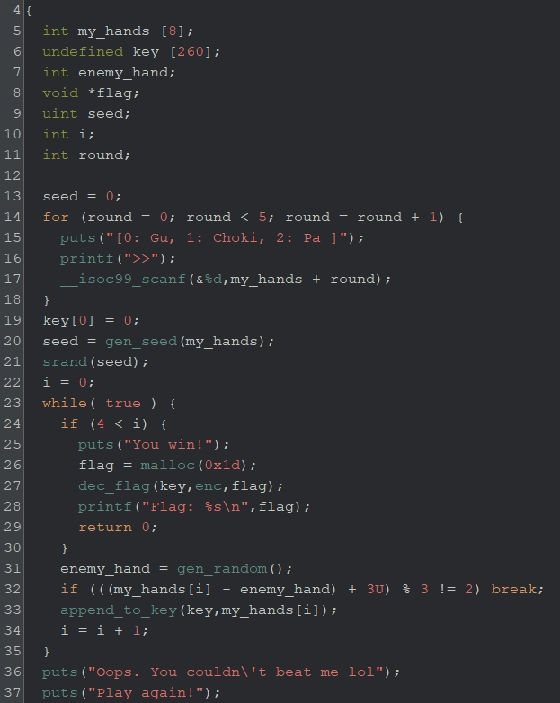
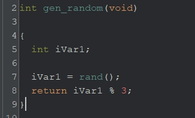
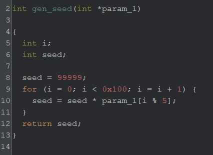

# junken2（written by 山田）
CTFで出題されることの多い、パズルチックな問題を作ってみました。疑似乱数は安全ではないということを学べるかと思います。

## 解法
ジャンケンAIが手を出すメカニズムを理解し、どのような手を出したら勝てるのかを考える。しかし、相手が出す手はこちらの手に依存しているので勝てる気がしない。ただ、seed値が整数オーバーフローすることを考慮すると、取りうるseed値は0か99999であることがわかる。Cプログラムを書いて試行すると、seed値が0の手に勝てる手を出せばよいことがわかる。

## 詳細
実行すると、最強AIとのジャンケンが始まる。5回分の手を予め出しておき、勝敗が決まるようだ。全部のラウンドで勝てないと、FLAGはくれなさそうである。
```
./janken2 
[0: Gu, 1: Choki, 2: Pa ]
>>0
[0: Gu, 1: Choki, 2: Pa ]
>>0
[0: Gu, 1: Choki, 2: Pa ]
>>2
[0: Gu, 1: Choki, 2: Pa ]
>>0
[0: Gu, 1: Choki, 2: Pa ]
>>2
Oops. You couldn't beat me lol
Play again!
```


`janken2.gzf`をGhidraで開きmain関数を解析すると、以下のことがわかる。（変数名は書き換え済）
- ジャンケンで出した5つの手を`my_hands`配列に格納
- `gen_seed`により、シード値を計算
- `gen_random`により、相手のだす手(`enemy_hand`)が決定
- じゃんけんの勝敗を判定
  - ５回全勝できれば、FLAGが出力されそう



### 乱数生成方法
FLAGを出力させるには全勝できるような手を出せればよく、そのためには相手の手がどんな仕組みで決まるのかを理解する必要がある。まず、`get_random`関数をみてやると、処理は単純で以下のことが分かる。

- `rand`関数により乱数（疑似）を生成
- 乱数の`mod 3`を返す

当たり前なのだが、seed値が分かれば乱数を求めることができる。では、seed値はどのように生成されているのだろうか？



### シード値生成方法
`get_seed`関数を見る。`gen_seed`は入力した手が格納される配列へのポインタを引数にとる。処理としては、初期値を99999とし、手の値(例えば、グーなら0)を256回乗算し続けている。



### シード生成のバグ
手を入力をした後にシード値を生成しているので、一見絶対に勝てないように見える。しかし、seed値の生成にはバグが存在している。

まず、手に一回でも0（グー）が含まれていると、シード値はかならず0になる。また、**一回でも2（パー）が含まれていても、シード値はかならず0になる。** これは、整数オーバーフローが原因で起こっている。最低でも2を50回は乗算するため、オーバーフローし値が0になる。

```c
int seed = 99999;
    int player_hands[5] = {1,1,1,1,2};
    for (int i = 0; i<256; i++){
        seed = seed * player_hands[i % 5];
    }
    // seed = 0
    printf("If you play Pa even once, seed is %d\n", seed);
```

これを踏まえて、他の手の入力条件は、一回もグーとパーが含まれないとき、つまりすべての手がチョキのときしかない。そして、このときのシード値は99999である。

以上より、シード値の取りうる値は**0**か**99999**しか無いことが分かる。そうであれば、それぞれのシード値における相手の手を求め、それに勝つような手を出せばよい。

### AIに勝つ手 
c言語のプログラムを書き、それぞれのシード値における手を求める。まず、シード値が99999のときの相手の手を求めてみると、`[Pa, Choki, Choki, Choki, Gu]` となる。しかし、全ての手がチョキのとき、この手には勝つことができない。

```c
srand(99999);
printf("if seed is 99999\n");
for (int round=0; round<5; round++){
    int npc = rand() % 3;
    switch (npc) {
        case 0:
            printf("Round %d: Gu\n", round);
            break;
        case 1:
            printf("Round %d: Choki\n", round);
            break;
        case 2:
            printf("Round %d: Pa\n", round);
            break;
        default:
            break;
    }
}

// Round 0: Pa
// Round 1: Choki
// Round 2: Choki
// Round 3: Choki
// Round 4: Gu
```

次に、seed値が0のときの相手の手を求めると、`[Choki, Choki, Gu, Choki, Pa]`となるので、`[Gu, Gu, Pa, Gu, Choki]` を出せば絶対に勝つことができるとわかる。

```c
srand(0);
printf("if seed is 0\n");
for (int round=0; round<5; round++){
    int npc = rand() % 3;
    switch (npc) {
        case 0:
            printf("Round %d: Gu\n", round);
            break;
        case 1:
            printf("Round %d: Choki\n", round);
            break;
        case 2:
            printf("Round %d: Pa\n", round);
            break;
        default:
            break;
    }
}
// Round 0: Choki
// Round 1: Choki
// Round 2: Gu
// Round 3: Choki
// Round 4: Pa
```

プログラムを実行し、先程の手を出すとFLAGが求まる。

```
./janken2 
[0: Gu, 1: Choki, 2: Pa ]
>>0
[0: Gu, 1: Choki, 2: Pa ]
>>0
[0: Gu, 1: Choki, 2: Pa ]
>>2
[0: Gu, 1: Choki, 2: Pa ]
>>0
[0: Gu, 1: Choki, 2: Pa ]
>>1
You win!
Flag: FLAG{Ha_Ha_Ha_its_ez_right?}
```
**FLAG{Ha_Ha_Ha_its_ez_right?}**