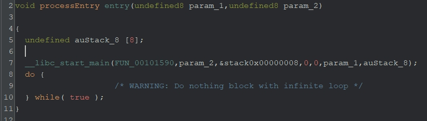
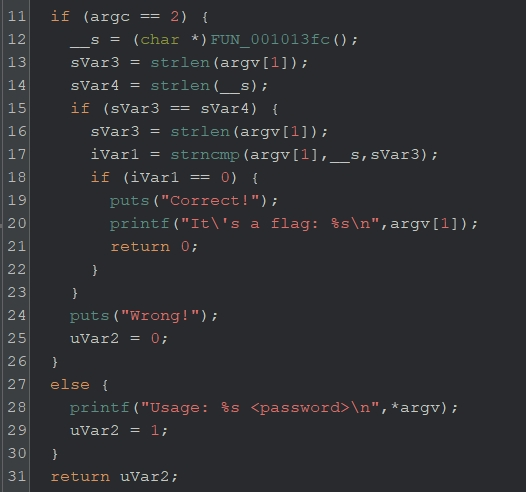
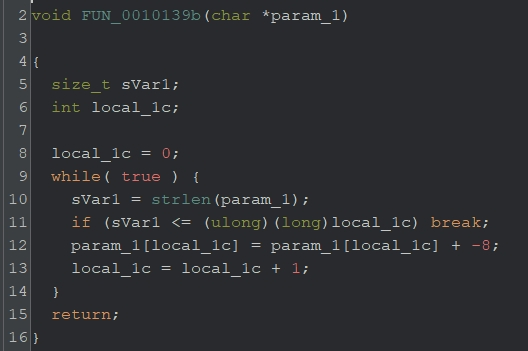

# strange（written by 山田）
今まで解いてきた問題は、関数名や変数名がGhidra上で明らかになっていたかと思います。しかし、実際のマルウェア解析などの場面においては、関数名が付いていることはほとんどありません。なぜソースコードで書いた関数名がGhidra上で見えるのかというと、シンボル情報というものがバイナリに含まれているからです。

マルウェアや商用プログラムなどは解析されたくないため、シンボル情報を残す理由がありません。シンボル情報が消されるとリバースエンジニアリングが難しくなるということを知ってほしく、今回の問題を作成しました。

## 解法
シンボル情報が消されたバイナリ内から、main関数を特定する。さまざまなジャンク関数（無意味なコード）が含まれているmain関数内から暗号化処理を特定し、復号コードを書く。

## 詳細
`strange.gzf`をGhidraで開くと、main関数が画面に表示されない。これはシンボル情報が消されているからであるが、`__libc_start_main`の第一引数を見ると、main関数を特定することができる。



main関数を解析すると、`FUN_001013fc`で返される`__s`と等しい文字列をパスワードとして入力すれば、`Correct!`と出力されそうであることがわかる。そのため、`FUN_001013fc`を解析し、`__s`が分かれば、それがFLAGだろうと推測できる。



## FUN_001013fc
`FUN_001013fc`関数を見ると、怪しげな配列が見つかる。
```c
  puVar1 = (undefined *)malloc(0x1e);
  *puVar1 = 0x4e;
  puVar1[1] = 0x54;
  puVar1[2] = 0x49;
  puVar1[3] = 0x4f;
  puVar1[4] = 0x83;
  puVar1[5] = 0x3d;
  puVar1[6] = 0x3f;
  puVar1[7] = 0x7a;
  puVar1[8] = 0x3c;
  puVar1[9] = 0x76;
  puVar1[10] = 0x6f;
  puVar1[0xb] = 0x3b;
  puVar1[0xc] = 0x67;
  puVar1[0xd] = 0x7f;
  puVar1[0xe] = 0x39;
  puVar1[0xf] = 0x3f;
  puVar1[0x10] = 0x70;
  puVar1[0x11] = 0x38;
  puVar1[0x12] = 0x7d;
  puVar1[0x13] = 0x3f;
  puVar1[0x14] = 0x67;
  puVar1[0x15] = 0x3d;
  puVar1[0x16] = 0x81;
  puVar1[0x17] = 0x75;
  puVar1[0x18] = 0x6a;
  puVar1[0x19] = 0x38;
  puVar1[0x1a] = 0x74;
  puVar1[0x1b] = 0x3d;
  puVar1[0x1c] = 0x85;
  puVar1[0x1d] = 0;
```

これらの配列を引数として、いくつかの関数が呼ばれている。関数がすべて呼ばれた後に、`puVar1`が返されている。そのため、`FUN_001013fc`関数から呼ばれている関数たちを解析して、復号処理を特定すればよさそうである。

詳細は割愛するが、２つの関数はジャンク関数で、重要なのは`FUN_0010139b`である。処理としては、1バイトごとに8を減算をしているだけである。



よって、先の怪しい配列の各要素から8を減算するpythonスクリプトを書けば、FLAGが求まる。

```python
enc = [0x4e, 0x54, 0x49, 0x4f, 0x83, 0x3d, 0x3f, 0x3b, 0x7a, 0x3c, 0x76, 0x6f, 0x3b, 0x67, 0x7f, 0x39, 0x3f, 0x70, 0x38, 0x7d, 0x3f, 0x67, 0x3d, 0x81, 0x75, 0x6a, 0x38, 0x74, 0x3d, 0x85]

print("".join(chr(e - 0x8) for e in enc))
```

**FLAG{573r4ng3_w17h0u7_5ymb0l5}**