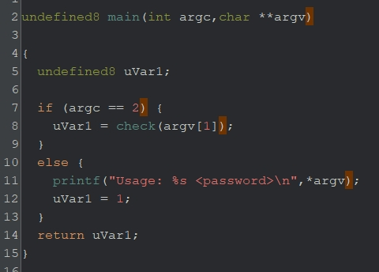
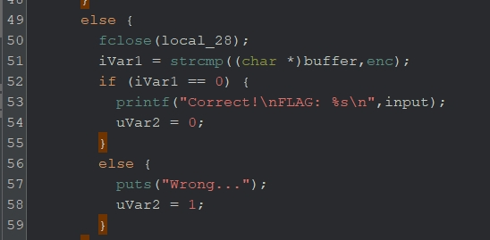
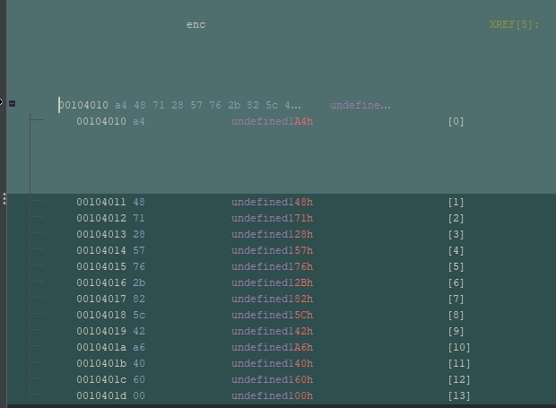
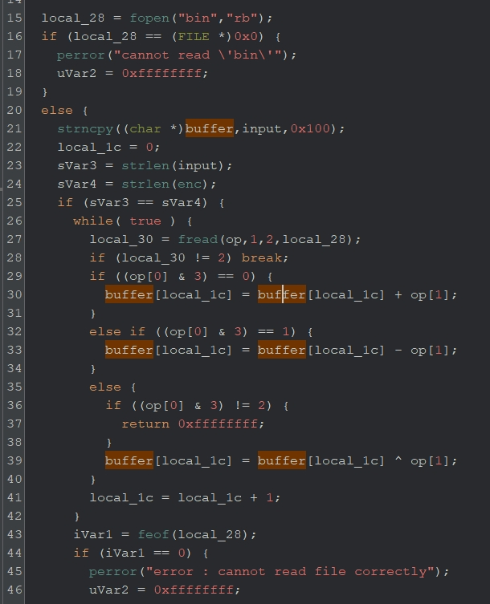

# vm（written by 山田）
マルウェアが解析を回避するテクニックの一つである仮想マシン（VM）ベースの問題を作ってみました。元のコードを仮想命令に変換し、仮想マシンがその命令を解釈し実行するため、元のコードをリバースエンジニアリングすることが難しくなります。今回はいくつかの演算を仮想命令として簡単に実装してみましたが、高度なVMではレジスタやスタックなども仮想マシンとして実装されることがあり、解析の難易度はかなり難しくなります。（[参考](https://www.0ffset.net/reverse-engineering/solving-a-vm-based-crackme/)）

## 解法
実装されている仮想命令と仮想命令による暗号方式を理解し、内部で比較されている暗号データを復号することでパスワードを求める。

## 詳細
`vm.gzf`をGhidraで開き、main関数を解析する。すると、コマンドライン引数で受け取ったパスワードを`check関数`の引数に渡しているのが見えるので、`check`関数でパスワードがあっているか処理していると推測できる。



`check`関数をざっくり眺めると、`Correct!`が出力される分岐(50行目)に遷移するためには、51行目の`buffer`とグローバル変数`enc`が一致すればよいことが分かる。



グローバル変数`enc`を見てやると、明らか暗号データが見える。



以上より、51行目時点で、`buffer`と`enc`が一致するような`buffer`を入力すれば、`Correct!`が出力されそうである。ただし、`buffer`は、`check`関数の引数として渡された後、暗号化されている。

### 暗号処理の特定
`check`関数の前半あたりを見てやると、入力文字列のコピー先である`buffer`は加算や減算、XORによって暗号化されていそうなことが分かる。具体的には、`op[0]`の値でif文の分岐が起こり、その分岐先によって演算する種類が決定する。演算で加えたり引いたりする値は`op[1]`である。

では、この`op`が何なのかというと、`bin`ファイルから読み込んだ2バイトである。この問題はVM問と言われるカテゴリの問題で、`bin`ファイルの内容を2バイトずつ読み込み、読み込んだ値に応じた仮想命令によって暗号化を行っている。



### 復号
`bin`ファイルの内容を読み込み、そのバイト列に応じた演算処理の逆を行ってやれば、FLAGを求めることができる。

pythonでソルバーを書くことでFLAGが求まる。
```python
enc = [0xa4, 0x48,0x71,0x28,0x57,0x76,0x2b,0x82,0x5c,0x42,0xa6,0x40,0x60]

with open("../file/bin", "rb") as f:
    i = 0
    data = f.read(2)
    while data:
        if data[0] == 0x00:
            enc[i] -= data[1]
        elif data[0] == 0x01:
            enc[i] += data[1]
        elif data[0] == 0x02:
            enc[i] ^= data[1]
        data = f.read(2)
        i += 1

print("".join([chr(i) for i in enc]))
```

**FLAG{345y_vm}**